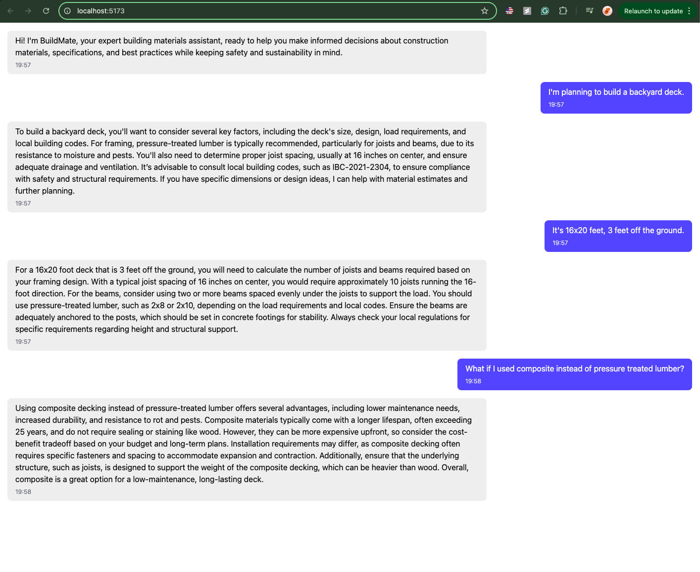

# BuildMate: AI-Powered Construction Materials Assistant


BuildMate is an intelligent AI assistant designed to help contractors and builders make informed decisions about construction materials. Leveraging advanced LLM technology and domain-specific knowledge, it provides real-time guidance on material selection, specifications, and best practices.



## 🚀 Key Features

- 🤖 Context-aware material recommendations using RAG system
- 📊 Intelligent query classification and routing
- 🏗️ Project planning and material quantity estimation
- 📋 Technical specifications and compliance guidance
- 🔍 Multi-turn conversation support
- ⚡ High-performance vector search
- 🛡️ Robust error handling and edge case management

## 🏗️ System Architecture

### Data Pipeline


### Chat Service Flow


## 🛠️ Technical Implementation

### Backend Architecture
```
backend/
├── data/
│   ├── raw_data.txt              # Raw construction materials data
│   ├── building_materials_docs.csv# Processed document store
│   ├── clean_data.json           # Structured material data
│   └── parser.py                 # Data processing utilities
├── services/
│   ├── chat_service.py           # Core chat processing logic
│   └── query_classifier.py       # Query intent classification
└── tests/
    ├── benchmark.py              # Performance testing
    └── evaluate.py               # Quality metrics
```

### Frontend Structure
```
frontend/
├── src/
│   ├── components/
│   │   ├── ChatInterface.jsx     # Main chat UI
│   │   └── MaterialCard.jsx      # Material display component
│   ├── hooks/
│   │   └── useChat.js           # Chat state management
│   └── services/
│       └── api.js               # API integration
└── public/
    └── assets/                  # Static resources
```

## 🔧 Technical Stack

### Backend
- **LLM Framework**: LangChain with GPT-4
- **Vector Store**: LanceDB with custom reranking
- **API**: FastAPI with async support
- **Embeddings**: OpenAI Ada-002
- **Testing**: pytest with custom benchmarking

### Frontend
- **Framework**: React 18 with Vite
- **Styling**: TailwindCSS
- **State Management**: React Context + Custom Hooks
- **API Client**: Axios with request interceptors

## 📦 Installation

### Prerequisites
- Python 3.10+
- Node.js 16+
- pnpm
- OpenAI API key

### Backend Setup
```bash
# Create and activate environment
conda create -n buildmate python=3.10
conda activate buildmate

# Install dependencies
pip install -r requirements.txt

# Set up environment variables
touch .env
# Add your OpenAI API key (OPENAI_API_KEY) to .env
```

### Frontend Setup
```bash
# Install pnpm globally (recommended)
npm install -g pnpm # Or use npm if preferred

# Install base dependencies
pnpm install

# Install Tailwind CSS and its peer dependencies
pnpm install -D tailwindcss postcss autoprefixer
npx tailwindcss init -p

# Install utility libraries
pnpm install axios dayjs classnames
```

## 🚀 Development

### Running the Application
```bash
# Start backend
cd backend
uvicorn main:app --reload --port 8000

# Start frontend
cd frontend
pnpm dev
```

### Running Tests
```bash
# Backend tests
cd backend
pytest

# Frontend tests
cd frontend
pnpm test
```

## 🎯 Core Features Implementation

### RAG System
- Custom document chunking strategy
- Hybrid search with semantic and keyword matching
- Dynamic context window management
- Automated metadata extraction

### Query Processing
- Intent classification using fine-tuned model
- Context-aware prompt engineering
- Multi-turn conversation tracking
- Dynamic response templating

### Performance Optimization
- Async query processing
- Batched vector operations
- Response caching
- Rate limiting and queue management

## 📊 Performance Metrics

- Average response time: <2s
- RAG retrieval accuracy: >85%
- Query classification accuracy: >90%
- Memory usage: <512MB

## 🔒 Security Considerations

- Input sanitization
- Rate limiting
- API key rotation
- Data encryption at rest
- CORS configuration
- Request validation

## 🤝 Contributing

1. Fork the repository
2. Create a feature branch


## 📄 License

This project is licensed under the MIT License - see the LICENSE file for details.

## 🙏 Acknowledgments

- OpenAI for GPT models
- LangChain community
- Construction industry experts who provided domain knowledge

## 📧 Support

For support and queries, please open an issue in the GitHub repository or contact the maintainers.